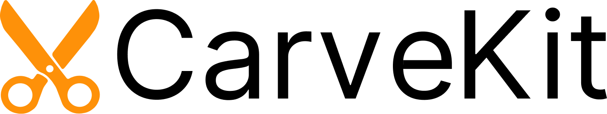

# <p align="center"> ✂️ CarveKit ✂️  </p>

<p align="center">  </p>

<p align="center">


</p>


**********************************************************************
<p align="center">  </p>

## 📄 О проекте:
Автоматизированное высококачественное удаление фона с изображения с использованием нейронных сетей

### Область направлений применения проекта:
В настоящее время решения для удаления фона имеют высокий спрос в различных областях: 
1. 📢 Рекламная индустрия: в данном случае удаление фона необходимо, чтобы создавать различные рекламные материалы, баннеры и логотипы. Это позволяет ускорить и облегчить работу дизайнеров, так как ручное удаление фона занимает много времени. Также, необходимо учитывать необходимость в высококачественных изображениях, это играет важную роль в восприятии различных рекламных товаров. 
2. 🛒 Продажа товаров через интернет: для сферы электронной коммерции, где важно представить товар в наиболее выгодном свете и более качественно презентовать с целью продажи, удаление фона является важной частью процессов. Например, торговая площадка “Amazon” имеет строгие рекомендации по изображению продукта, включая требование о том, чтобы основное изображение было хорошего качества на чистом белом фоне. Это правило гарантирует, что основное внимание остается исключительно на продукте, и обеспечивает единый внешний вид товаров на их платформе. 
3. 🏥 Медицинские и научные исследования и диагностика: для таких видов исследований как компьютерная томография и магнитно-резонансная томография удаление фона может решать такую задачу как получение более качественных изображений для диагностики различных заболеваний, в том числе и на ранних стадиях.
4. 👁️ Компьютерное зрение и искусственный интеллект: удаление фона широко используется в области компьютерного зрения и искусственного интеллекта для обнаружения и классификации объектов на изображениях. Путем удаления фона можно упростить процесс обработки изображений и увеличить точность алгоритмов распознавания объектов. Одним из вариантов является использование в научной области ядерной техники и радиационной безопасности для визуализации радиоактивных материалов, для обработки изображений и отображения данных, что способствует более точному анализу, классификации и управлению радиоактивными материалами и обеспечению безопасности. 
Удаление фона используется в различных прикладных решениях в разных областях. Программный комплекс можно переконфигурировать под различные задачи и нужды.

## 🖼️ Набор данных CarveSet V2.0:
Мы собрали обширный набор данных, охватывающий наиболее распространенные классы объектов, 
предназначенных для удаления фона.

Он включает фотографии объектов, принадлежащих 9 различным классам.

#### Распределение классов объектов в наборе данных CarveSet V2.0:

| Класс объектов                | Кол-во изображений |
|-------------------------------|--------------------|
| 🚗 автомобили                 | 1878               |
| 👗 одежда                     | 1840               |
| 🏠 предметы быта              | 1878               |
| 📱 электроника                | 1806               |
| 🧸 детские игрушки            | 1785               |
| 🍳 кухонные принадлежности    | 1878               |
| 👨‍👩‍👧‍👦 люди              | 1777               |
| 🏡 объекты в жилых помещениях | 1777               |
| 🐾 животные                   | 1878               |

Общее количество изображений в наборе данных: **16 497**.
####  Информация о базе изображений в наборе данных

1.  **CarveSet** - содержит 3 172 изображения высокого качества размером примерно 2500x2500 пикселей, собранных вручную из [Pexels](https://www.pexels.com/), [Unsplash](https://unsplash.com/).
2.  **SOPG** - состоит из 13 325 изображений, увеличенных в 4 раза из набора данных [SOPG](https://huggingface.co/datasets/absinc/sopg), 
размером примерно 2048x1536 пикселей. 

Более подробная информация: [Набор данных CarveSet](./docs/readme/carveset/ru.md)

## 🎆 Особенности:  
- Высокое качество выходного изображения
- Работает в автономном режиме
- Пакетная обработка изображений
- Поддержка NVIDIA CUDA и процессорной обработки
- Поддержка FP16: быстрая обработка с низким потреблением памяти
- Легкое взаимодействие и запуск
- 100% совместимое с remove.bg API(REST API реализован при посредством FastAPI)
- Удаляет фон с волос
- Автоматический выбор лучшего метода для изображения пользователя
- Простая интеграция с вашим кодом
- Модели размещены на [HuggingFace](https://huggingface.co/Carve)

## 🏛️ Архитектура проекта
[Описание](./docs/readme/architecture/ru.md)

## 📑 Документация по реализованным алгоритмам и заметки по конфигурации параметров настройке ПО
[Описание](./docs/readme/algos/ru.md)

## 🖼️ Методы пред и постобработки изображений:
### 🔍 Предобработка изобрадений:
* `none` - Предобработка не используется.
* [`autoscene`](https://huggingface.co/Carve/scene_classifier/) - Автоматически определяет тип сцены с помощью классификатора и применяет соответствующую модель. (По умолчанию)
* `auto` - Выполняет глубокий анализ изображения и более точно определяет лучший метод удаления фона. Использует классификатор объектов и классификатор сцены вместе.
> ### Важно: 
> 1. `AutoScene` и `auto` могут переопределить модель и параметры, указанные пользователем, без уведомления.
> Итак, если вы хотите использовать конкретную модель, сделать все постоянными и т. д., вам следует сначала отключить методы автоматической предварительной обработки!
> 2. На данный момент для метода `auto` выбираются универсальные модели для некоторых конкретных доменов, так как добавленных моделей в настоящее время недостаточно для такого количества типов сцен.
> В будущем, когда будет добавлено некоторое разнообразие моделей, автоподбор будет переписан в лучшую сторону.

### ✂ Методы постобработки:
* `none` - методы постобработки не используются
* `fba` - Этот алгоритм улучшает границы изображения при удалении фона с изображений с волосами и т.д. с помощью нейронной сети FBA Matting.
* `cascade_fba` (по умолчанию) - Этот алгоритм уточняет маску сегментации с помощью нейронной сети CascadePSP, а затем применяет алгоритм FBA.

## 🏷 Настройка для обработки на центральном процессоре:
1. 
```bash
# Arch/Arch-based
pacman -S lib32-libglvnd
# Debian/Ubuntu
apt install libgl1
```

2. `pip install git+https://github.com/OPHoperHPO/freezed_carvekit_2023 --extra-index-url https://download.pytorch.org/whl/cpu`
> Проект поддерживает версии Python от 3.8 до 3.10.4.

> ### Важно:
> В ходе работы программного комплекса на ЦП вы можете увидеть следующее предупреждение \
> \
> UserWarning: The CascadePSP finetuned model has an extremely slow processing bug on the CPU. Use GPU to load it. Using pretrained model instead. \
> \
> В связи с внутренними особенностями модели и/или PyTorch дообученная на нашем наборе данных модель не может быть использована на ЦП, в связи с чем используется стандартная. В связи с тем, что обработка на ЦП не является приоритетной для проекта и устройство соответствующее минимальным техническим требованиям способно обрабатывать изображения при помощи ГП, задача по исследованию и, возможно, устранению этой проблемы имеет низкий приоритет
## 🏷 Настройка для обработки на графическом процессоре:  
1. Убедитесь, что у вас есть графический процессор NVIDIA с 8 ГБ видеопамяти.
2. Установите `CUDA Toolkit и Видеодрайвер для вашей видеокарты.`
3. 
```bash
# Arch/Arch-based
pacman -S lib32-libglvnd glib2 lib32-libglvnd
# Debian/Ubuntu
apt install libgl1 libglib2.0-0
```

4. `pip install git+https://github.com/OPHoperHPO/freezed_carvekit_2023 --extra-index-url https://download.pytorch.org/whl/cu113`
> Проект поддерживает версии Python от 3.8 до 3.10.4.
> Пожалуйста, соберите и установите carvekit прямо из этого репозитория.
> Не используйте готовые двоичные файлы из PyPI или других уже имеющихся ссылок. Это только для основного репозитория.
## 🧰 Интеграция в код:  
### Если вы хотите быстрее приступить к работе без дополнительной настройки
``` python
import torch
from carvekit.api.high import HiInterface

# Check doc strings for more information
interface = HiInterface(object_type="auto",  # Can be "object" or "hairs-like" or "auto"
                        batch_size_seg=5,
                        batch_size_pre=5,
                        batch_size_matting=1,
                        batch_size_refine=1,
                        device='cuda' if torch.cuda.is_available() else 'cpu',
                        seg_mask_size=960,  # Use 960 for Tracer B7 and 1024 for ISNet
                        matting_mask_size=2048,
                        refine_mask_size=900,
                        trimap_prob_threshold=231,
                        trimap_dilation=30,
                        trimap_erosion_iters=5,
                        fp16=False)
images_without_background = interface(['./tests/data/cat.jpg'])
cat_wo_bg = images_without_background[0]
cat_wo_bg.save('2.png')

                   
```
### Аналог метода предварительной обработки `auto` из cli
``` python
from carvekit.api.autointerface import AutoInterface
from carvekit.ml.wrap.scene_classifier import SceneClassifier
from carvekit.ml.wrap.yolov4 import SimplifiedYoloV4

scene_classifier = SceneClassifier(device="cpu", batch_size=1)
object_classifier = SimplifiedYoloV4(device="cpu", batch_size=1)

interface = AutoInterface(scene_classifier=scene_classifier,
                          object_classifier=object_classifier,
                          segmentation_batch_size=1,
                          postprocessing_batch_size=1,
                          postprocessing_image_size=2048,
                          refining_batch_size=1,
                          refining_image_size=900,
                          segmentation_device="cpu",
                          fp16=False,
                          postprocessing_device="cpu")
images_without_background = interface(['./tests/data/cat.jpg'])
cat_wo_bg = images_without_background[0]
cat_wo_bg.save('2.png')
```
### Если вы хотите провести детальную настройку
``` python
import PIL.Image

from carvekit.api.interface import Interface
from carvekit.ml.wrap.fba_matting import FBAMatting
from carvekit.ml.wrap.scene_classifier import SceneClassifier
from carvekit.ml.wrap.cascadepsp import CascadePSP
from carvekit.ml.wrap.tracer_b7 import TracerUniversalB7
from carvekit.pipelines.postprocessing import CasMattingMethod
from carvekit.pipelines.preprocessing import AutoScene
from carvekit.trimap.generator import TrimapGenerator

# Check doc strings for more information
seg_net = TracerUniversalB7(device='cpu',
                            batch_size=1, fp16=False)
cascade_psp = CascadePSP(device='cpu',
                         batch_size=1,
                         input_tensor_size=900,
                         fp16=False,
                         processing_accelerate_image_size=2048,
                         global_step_only=False)
fba = FBAMatting(device='cpu',
                 input_tensor_size=2048,
                 batch_size=1, fp16=False)

trimap = TrimapGenerator(prob_threshold=231, kernel_size=30, erosion_iters=5)

scene_classifier = SceneClassifier(device='cpu', batch_size=5)
preprocessing = AutoScene(scene_classifier=scene_classifier)

postprocessing = CasMattingMethod(
    refining_module=cascade_psp,
    matting_module=fba,
    trimap_generator=trimap,
    device='cpu')

interface = Interface(pre_pipe=preprocessing,
                      post_pipe=postprocessing,
                      seg_pipe=seg_net)

image = PIL.Image.open('tests/data/cat.jpg')
cat_wo_bg = interface([image])[0]
cat_wo_bg.save('2.png')     
```


## 🧰 Запустить через консоль:  
 * ```python3 -m carvekit  -i <input_path> -o <output_path> --device <device>```  
 
### Все доступные аргументы:  
````
Usage: carvekit [OPTIONS]

  Performs background removal on specified photos using console interface.

Options:
  -i ./2.jpg                   Путь до входного файла или директории. Путь до ДИРЕКТОРИИ должен 
                               быть указан при использовании --recursive [обязателен]
  -o ./2.png                   Путь для сохранения результата обработки. По умолчанию:
                               /<путь до исходного файла>/<имя файла>_bg_removed.png
  --pre [none|autoscene|auto]  Метод предобработки, по умолчанию: autoscene
  --post [none|fba|cascade_fba]
                               Метод постобработки, по умолчанию: cascade_fba
  --net [u2net|deeplabv3|basnet|tracer_b7|isnet]
                               Нейронная сеть для сегментации, по умолчанию: tracer_b7
  --recursive                  Включение рекурсивного поиска изображений в папке
  --batch_size 10              Размер пакета изображений, загруженных в ОЗУ 
  --batch_size_pre 5           Размер пакета для списка изображений, которые будут обрабатываться
                               методом предварительной обработки
  --batch_size_seg 5           Размер пакета изображений для обработки с помощью
                               сегментации

  --batch_size_mat 1           Размер пакета изображений для обработки с помощью
                               матирования

  --batch_size_refine 1        Размер пакета для списка изображений, которые будут обрабатываться уточняющей сетью

  --seg_mask_size 960          Размер исходного изображения для сегментирующей
                               нейронной сети

  --matting_mask_size 2048     Размер исходного изображения для матирующей
                               нейронной сети
  --refine_mask_size 900       Размер входного изображения для уточняющей нейронной сети.
  --trimap_dilation 30         Размер радиуса смещения от маски объекта в пикселях при 
                               формировании неизвестной области
                               
  --trimap_erosion 5           Количество итераций эрозии, которым будет подвергаться маска 
                               объекта перед формированием неизвестной области.
                               
  --trimap_prob_threshold 231  Порог вероятности, при котором будут применяться
                               операции prob_filter и prob_as_unknown_area

  --device cpu                 Устройство обработки.
  
  --fp16                       Включает обработку со смешанной точностью. 
                               Не поддерживается для модели U2NET
                               Используйте только с CUDA. Поддержка процессора является экспериментальной!
                               
  --help                       Показать это сообщение и выйти.

````
## 📦 Запустить фреймворк / FastAPI HTTP API сервер с помощью Docker:

Использование API через Docker — это **быстрый** и эффективный способ получить работающий API.\


<p align="center"> 
 
 
</p>

>### Важная информация:
>1. Образ Docker имеет фронтенд по умолчанию по адресу `/` и документацию к API по адресу `/docs`.
>2. Обратите внимание, после нажатия кнопки "Remove background" возможно длительное ожидание при условии обработки первого ихображения. Последующие обрабатываются быстрее. Отслеживать статус текущего запроса можно в инструментах разработчика в браузере на вкладке "Сеть". Возможно в будущих версиях интерфейс будет удобнее, но на текущий момент web версия не является приоритетной, поскольку реализует лишь демонстрацию возможностей, которая возможна и при помощи CLI и кода.
>3. Аутентификация **включена** по умолчанию. \
> **Ключи доступа сбрасываются** при каждом перезапуске контейнера, если не установлены специальные переменные окружения. \
> `docker-compose.<device>.yml` для более подробной информации.
>4. **При использовании настроек по умолчанию для использования фронтентда требуется API ключ.** \
> Вы должны посмотреть свои ключи доступа в логах докер-контейнера. В первой строке логов контейнера api. \
> "auth":{"auth":true,"admin_token":"….","allowed_tokens":["…"]}} \
> admin_token — это ключ, который вы можете использовать для доступа к обработке на фронтенд, /api/removebg, /api/admin/config. \
> allowed_tokens — это ключи, которые вы можете использовать для доступа к обработке на фронтенд, /api/removebg.
>5. Примеры работы с API.\
> См. `docs/code_examples/python` для уточнения деталей
### 🔨 Создать и запустить контейнер:
1. Установите `docker, docker-compose, дополнительные зависимости для хост системы. (см. ниже)`
2. Соберите образ: `docker-compose -f docker-compose.cpu.yml build` для обработки на ЦП
3. или `docker-compose -f docker-compose.cuda.yml build` для обработки на ГП.
3. Запустите `docker-compose -f docker-compose.cpu.yml up -d`  # для обработки на ЦП
4. Запустите `docker-compose -f docker-compose.cuda.yml up -d`  # для обработки на ГП
> Также вы можете монтировать папки с вашего компьютера в docker container
> и использовать интерфейс командной строки внутри контейнера докера для обработки
> файлов в этой папке.

> ### Важно:
> При сборке контейнера могут появиться предупреждения вида
> 
> debconf: delaying package configuration, since apt-utils is not installed
> 
> Предупреждение связано с некорректно составленным базовым образом python и не может быть исправлено. В связи с тем, что на работоспособность и результаты сборки это предупреждение не влияет, игнорируйте его появление
> 
> Так же при запуске с использованием ГП требуется установить дополнительные зависимости для доступа к ГП со стороны Docker.
> 
> Для Arch-based дистрибутивов установите пакеты nvidia-container-toolkit nvidia-container-runtime из aur
> 
> yay -S nvidia-container-toolkit nvidia-container-runtime
> 
> Для Debian-based дистрибутивов следуйте [инструкциям Nvidia](https://docs.nvidia.com/datacenter/cloud-native/container-toolkit/latest/install-guide.html)
> Создание docker образа в Windows официально не поддерживается. Однако вы можете попробовать использовать WSL2 или «Linux container mode» в Docker Desktop.

## ☑️ Тестирование

### ☑️ Тестирование с локальным окружением
1. `pip install -r requirements_test.txt`
2. `pytest`

### ☑️ Тестирование с Docker
1. Запустите `docker-compose -f docker-compose.cpu.yml run carvekit_api pytest`  # для тестирования на ЦП
2. Run `docker-compose -f docker-compose.cuda.yml run carvekit_api pytest`  # для тестирования на GPU

## 👪 Ссылки, структура репозития и другая информация: [Больше информации](./docs/readme/other/ru.md)
## 📧 __Обратная связь__
Буду рад отзывам о проекте и предложениям об интеграции.

По всем вопросам писать: [farvard34@gmail.com](mailto://farvard34@gmail.com)
