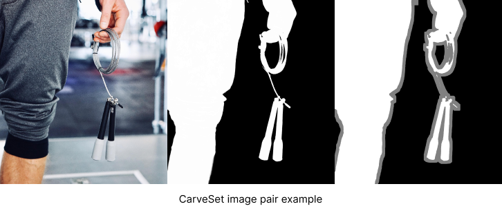
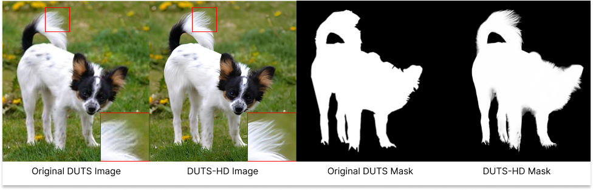

# <p align="center"> ✂️ CarveKit ✂️  </p>

<p align="center">  </p>

<p align="center">


</p>


**********************************************************************
<p align="center">  </p>


> The higher resolution images from the picture above can be seen in the docs/imgs/compare/ and docs/imgs/input folders.

#### 📙 README Language
[Russian](docs/readme/ru.md)
[English](README.md)

## 📄 About project:  
Automated high-quality background removal framework for an image using neural networks.

### Area of application of the project:
Currently, background removal solutions are in high demand in various fields:

Advertising Industry: In this case, background removal is necessary for creating various advertising materials, banners, and logos. This speeds up and simplifies the work of designers, as manual background removal takes a lot of time. It's also important to consider the need for high-quality images, which plays a significant role in the perception of various advertising products.

Online Retail: For the e-commerce sector, where it is crucial to present the product in the most favorable light and more qualitatively for the purpose of sales, background removal is an essential part of the process. For instance, the online marketplace "Amazon" has strict product image guidelines, including the requirement that the primary image be of good quality and on a clean white background. This rule ensures that the main focus remains solely on the product and maintains a uniform appearance of products on their platform.
Medical and Scientific Research and Diagnostics: For types of research such as computed tomography and magnetic resonance imaging, background removal can solve the problem of obtaining higher-quality images for diagnosing various diseases, including in the early stages.

Computer Vision and Artificial Intelligence: Background removal is widely used in the field of computer vision and artificial intelligence for detecting and classifying objects in images. By removing the background, the image processing task can be simplified and the accuracy of object recognition algorithms can be improved. One application is in the scientific field of nuclear technology and radiation safety for visualizing radioactive materials, for image processing and data display, which contributes to more accurate analysis, classification, and management of radioactive materials and ensures safety.

Background removal is used in various applied solutions across different fields. The software suite can be reconfigured to suit various tasks and needs.

## 🎆 Features:  
- High Quality
- Works offline
- Batch Processing
- NVIDIA CUDA and CPU processing
- FP16 inference: Fast inference with low memory usage
- Easy inference
- 100% remove.bg compatible FastAPI HTTP API 
- Removes background from hairs
- Automatic best method selection for user's image
- Easy integration with your code
- Models hosted on [HuggingFace](https://huggingface.co/Carve)

## ⛓️ How does it work?
It can be briefly described as
1. The user selects a picture or a folder with pictures for processing
2. The photo is preprocessed to ensure the best quality of the output image
3. Using machine learning technology, the background of the image is removed
4. Image post-processing to improve the quality of the processed image
## 🎓 Implemented Neural Networks:
|        Networks         |                   Target                    |                   Accuracy                   |
|:-----------------------:|:-------------------------------------------:|:--------------------------------------------:|
| **Tracer-B7** (default) |     **General** (objects, animals, etc)     | **96.2%** (mean F1-Score, CarveSet/test, HR) |
|        **ISNet**        |     **Hairs** (hairs, people, animals)      |  **97%** (mean F1-Score, CarveSet/test, HR)  |
|         U^2-net         | **Hairs** (hairs, people, animals, objects) |      80.4% (mean F1-Score, DUTS-TE, LR)      |
|         BASNet          |        **General** (people, objects)        |      80.3% (mean F1-Score, DUTS-TE, LR)      |
|        DeepLabV3        |         People, Animals, Cars, etc          |      67.4% (mean IoU, COCO val2017, LR)      |

> HR - High resolution images.
> LR - Low resolution images.
### Recommended parameters for different models
|  Networks   | Segmentation mask  size | Trimap parameters (dilation, erosion) |
|:-----------:|:-----------------------:|:-------------------------------------:|
| `tracer_b7` |           960           |                (30, 5)                |
|   `isnet`   |          1024           |                (30, 5)                |
|   `u2net`   |           320           |                (30, 5)                |
|  `basnet`   |           320           |                (30, 5)                |
| `deeplabv3` |          1024           |               (40, 20)                |

> ### Notes: 
> 1. The final quality may depend on the resolution of your image, the type of scene or object.
> 2. Use **ISNet for hairs** or **U2-Net for hairs** and **Tracer-B7 for general images** and correct parameters. \
> It is very important for final quality! Example images was taken by using U2-Net and FBA post-processing.
## 🖼️ Image pre-processing and post-processing methods:
### 🔍 Preprocessing methods:
* `none` - No preprocessing methods used.
* [`autoscene`](https://huggingface.co/Carve/scene_classifier/) - Automatically detects the scene type using classifier and applies the appropriate model. (default)
* `auto` - Performs in-depth image analysis and more accurately determines the best background removal method. Uses object classifier and scene classifier together. 
> ### Notes: 
> 1. `AutoScene` and `auto` may override the model and parameters specified by the user without logging. 
> So, if you want to use a specific model, make all constant etc., you should disable auto preprocessing methods first!
> 2. At the moment for `auto` method universal models are selected for some specific domains, since the added models are currently not enough for so many types of scenes.
> In the future, when some variety of models is added, auto-selection will be rewritten for the better.
### ✂ Post-processing methods:
* `none` - No post-processing methods used.
* `fba` - This algorithm improves the borders of the image when removing the background from images with hair, etc. using FBA Matting neural network.
* `cascade_fba` (default) - This algorithm refines the segmentation mask using CascadePSP neural network and then applies the FBA algorithm.

## 🏷 Setup for CPU processing:
1. `pip install git+https://github.com/OPHoperHPO/freezed_carvekit_2023 --extra-index-url https://download.pytorch.org/whl/cpu`
> The project supports python versions from 3.8 to 3.10.4
## 🏷 Setup for GPU processing:  
1. Make sure you have an NVIDIA GPU with 8 GB VRAM.
2. Install `CUDA Toolkit and Video Driver for your GPU`
3. `pip install git+https://github.com/OPHoperHPO/freezed_carvekit_2023 --extra-index-url https://download.pytorch.org/whl/cu113`
> The project supports python versions from 3.8 to 3.10.4
> Please, build and install carvekit directly from this repo. 
> Don't use prebuilt binaries from PyPI or other already links. It's only for main repo.
## 🧰 Interact via code:  
### If you don't need deep configuration or don't want to deal with it
``` python
import torch
from carvekit.api.high import HiInterface

# Check doc strings for more information
interface = HiInterface(object_type="auto",  # Can be "object" or "hairs-like" or "auto"
                        batch_size_seg=1,
                        batch_size_pre=5,
                        batch_size_matting=1,
                        batch_size_refine=1,
                        device='cuda' if torch.cuda.is_available() else 'cpu',
                        seg_mask_size=960,  # Use 960 for Tracer B7 and 320 for U2Net
                        matting_mask_size=2048,
                        refine_mask_size=900,
                        trimap_prob_threshold=231,
                        trimap_dilation=30,
                        trimap_erosion_iters=5,
                        fp16=False)
images_without_background = interface(['./tests/data/cat.jpg'])
cat_wo_bg = images_without_background[0]
cat_wo_bg.save('2.png')

                   
```
### Analogue of `auto` preprocessing method from cli
``` python
from carvekit.api.autointerface import AutoInterface
from carvekit.ml.wrap.scene_classifier import SceneClassifier
from carvekit.ml.wrap.yolov4 import SimplifiedYoloV4

scene_classifier = SceneClassifier(device="cpu", batch_size=1)
object_classifier = SimplifiedYoloV4(device="cpu", batch_size=1)

interface = AutoInterface(scene_classifier=scene_classifier,
                          object_classifier=object_classifier,
                          segmentation_batch_size=1,
                          postprocessing_batch_size=1,
                          postprocessing_image_size=2048,
                          refining_batch_size=1,
                          refining_image_size=900,
                          segmentation_device="cpu",
                          fp16=False,
                          postprocessing_device="cpu")
images_without_background = interface(['./tests/data/cat.jpg'])
cat_wo_bg = images_without_background[0]
cat_wo_bg.save('2.png')
```
### If you want control everything
``` python
import PIL.Image

from carvekit.api.interface import Interface
from carvekit.ml.wrap.fba_matting import FBAMatting
from carvekit.ml.wrap.scene_classifier import SceneClassifier
from carvekit.ml.wrap.cascadepsp import CascadePSP
from carvekit.ml.wrap.tracer_b7 import TracerUniversalB7
from carvekit.pipelines.postprocessing import CasMattingMethod
from carvekit.pipelines.preprocessing import AutoScene
from carvekit.trimap.generator import TrimapGenerator

# Check doc strings for more information
seg_net = TracerUniversalB7(device='cpu',
                            batch_size=1, fp16=False)
cascade_psp = CascadePSP(device='cpu',
                         batch_size=1,
                         input_tensor_size=900,
                         fp16=False,
                         processing_accelerate_image_size=2048,
                         global_step_only=False)
fba = FBAMatting(device='cpu',
                 input_tensor_size=2048,
                 batch_size=1, fp16=False)

trimap = TrimapGenerator(prob_threshold=231, kernel_size=30, erosion_iters=5)

scene_classifier = SceneClassifier(device='cpu', batch_size=5)
preprocessing = AutoScene(scene_classifier=scene_classifier)

postprocessing = CasMattingMethod(
    refining_module=cascade_psp,
    matting_module=fba,
    trimap_generator=trimap,
    device='cpu')

interface = Interface(pre_pipe=preprocessing,
                      post_pipe=postprocessing,
                      seg_pipe=seg_net)

image = PIL.Image.open('tests/data/cat.jpg')
cat_wo_bg = interface([image])[0]
cat_wo_bg.save('2.png')      
```


## 🧰 Running the CLI interface:  
 * ```python3 -m carvekit  -i <input_path> -o <output_path> --device <device>```  
 
### Explanation of args:  
````
Usage: carvekit [OPTIONS]

  Performs background removal on specified photos using console interface.

Options:
  -i ./2.jpg                   Path to input file or dir  [required]
  -o ./2.png                   Path to output file or dir
  --pre autoscene              Preprocessing method
  --post cascade_fba           Postprocessing method.
  --net tracer_b7              Segmentation Network. Check README for more info.
  
  --recursive                  Enables recursive search for images in a folder
  --batch_size 10              Batch Size for list of images to be loaded to
                               RAM
                               
  --batch_size_pre 5           Batch size for list of images to be
                               processed by preprocessing method network
                               
  --batch_size_seg 5           Batch size for list of images to be processed
                               by segmentation network

  --batch_size_mat 1           Batch size for list of images to be processed
                               by matting network

  --batch_size_refine 1        Batch size for list of images to be
                                  processed by refining network

  --seg_mask_size 960          The size of the input image for the
                               segmentation neural network. Use 960 for Tracer B7 and 1024 for ISNet

  --matting_mask_size 2048     The size of the input image for the matting
                               neural network.

  --refine_mask_size 900       The size of the input image for the refining
                                  neural network.

  --trimap_dilation 30       The size of the offset radius from the
                                  object mask in pixels when forming an
                                  unknown area
  --trimap_erosion 5        The number of iterations of erosion that the
                                  object's mask will be subjected to before
                                  forming an unknown area
  --trimap_prob_threshold 231
                                  Probability threshold at which the
                                  prob_filter and prob_as_unknown_area
                                  operations will be applied

  --device cpu                 Processing Device.
  --fp16                       Enables mixed precision processing. Use only with CUDA. CPU support is experimental!
  --help                       Show this message and exit.


````
## 📦 Running the Framework / FastAPI HTTP API server via Docker:
Using the API via docker is a **fast** and non-complex way to have a working API.
> **Our docker images are available on [Docker Hub](https://hub.docker.com/r/anodev/carvekit).** \
> Version tags are the same as the releases of the project with suffixes `-cpu` and `-cuda` for CPU and CUDA versions respectively.


<p align="center"> 
 
 
</p>

>### Important Notes:
>1. Docker image has default front-end at `/` url and FastAPI backend with docs at `/docs` url.
>2. Authentication is **enabled** by default. \
> **Token keys are reset** on every container restart if ENV variables are not set. \
See `docker-compose.<device>.yml` for more information. \
> **You can see your access keys in the docker container logs.**
> 
>3. There are examples of interaction with the API.\
> See `docs/code_examples/python` for more details
### 🔨 Creating and running a container:
1. Install `docker-compose`
2. Run `docker-compose -f docker-compose.cpu.yml up -d`  # For CPU Processing
3. Run `docker-compose -f docker-compose.cuda.yml up -d`  # For GPU Processing
> Also you can mount folders from your host machine to docker container
> and use the CLI interface inside the docker container to process 
> files in this folder. 

> Building a docker image on Windows is not officially supported. You can try using WSL2 or "Linux Containers Mode" but I haven't tested this.

## ☑️ Testing

### ☑️ Testing with local environment
1. `pip install -r requirements_test.txt`
2. `pytest`

### ☑️ Testing with Docker
1. Run `docker-compose -f docker-compose.cpu.yml run carvekit_api pytest`  # For testing on CPU
2. Run `docker-compose -f docker-compose.cuda.yml run carvekit_api pytest`  # For testing on GPU

### 🖼️ CarveSet Dataset V1.0:
<div> 

 

</div>

We have collected an extensive dataset covering the most common categories of objects intended for background removal.
It includes about 179 object names belonging to 8 different categories. (CarveSet subset)

Total number of images in the dataset: **20,155**.
####  Information about the image database in the dataset
1.  **CarveSet** - contains 4,583 high-quality images with a size of approximately 2500x2500 pixels.
2.  **DUTS-HD** - consists of 15,572 images, magnified 4 times from the DUTS dataset,
with a size of approximately 1600x1600 pixels. 
The dataset was re-annotated with controlled enhancement of the output mask. 
The images were upscaled, which added new details (see figure).

More info: [CarveSet Dataset](docs/carveset/carveset.md)

## 👪 Credits: [More info](docs/CREDITS.md)

## 📧 __Feedback__
I will be glad to receive feedback on the project and suggestions for integration.

For all questions write: [farvard34@gmail.com](mailto://farvard34@gmail.com)
