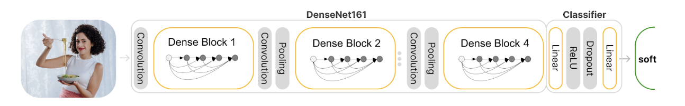

# Документация по реализованным алгоритмам

Программный комлекс реализует следующие алгоритмы и методы:

## Модуль предобработки

### Назначение и состав:
Модуль предобработки выполняет первичный анализ изображения на предмет типа сцены и объектов,
расположенных на изображении, для выбора оптимального метода для удаления фона. 
Данный компонент ПО состоит из нескольких частей:
*    Подмодуль классификации типа сцены;
*    Подмодуль классификации объектов;
*    Методы связки подмодулей.

### Классификатор сцены
#### Описание задачи и метода
Задача удаления фона с разных категорий предметов и типов сцен часто требует применения разных или комбинированных методов удаления фона. При этом не всегда с помощью обычных алгоритмов получается точно определить, какой метод нужно применять ввиду нетипизированных данных, которые могут прийти на вход в систему.  
Для решения проблем выбора метода удаления фона и отсутствия строгой типизации входных данных будем использовать метод с использованием машинного обучения. С точки зрения машинного обучения данная задача представляет собой классификацию изображений на определенные классы.

В рамках текущей задачи определим следующие виды классов:
* Класс hard обозначает группу сцен, к которым требуется применять более грубый метод удаления фона, предназначенный для объектов с краем без мелких деталей;
* Класс soft обозначает группу сцен, к которым требуется применять мягкий метод удаления фона, предназначенный для людей, волос, одежды и других похожих типов объектов;
* Класс digital обозначает группу изображений с цифровой графикой, например снимки экрана, логотипы и т.д. 

Таким образом при помощи классификатора получаем из предобработанного изображения вероятности принадлежности изображения к каждому из 3 классов. Выбирая класс с максимальной вероятностью отношения к изображению получаем наиболее вероятный тип сцены, содержащийся в изображении. 

#### Описание архитектуры
В качестве основной нейросети для решения задачи использовалась нейросеть DenseNet161 для извлечения признаков объектов с надстройкой в виде Linear слоев классификатора.

<div align="center">

<strong>Схема архитектуры классификатора</strong>
</div>

#### Описание реализации
Классификатор представлен в ПК в виде класса SceneClassifier. Архитектура и веса встроены в интегрированную модель.

### Классификатор объектов
#### Описание задачи и метода
После определения типа сцены и группы методов необходимо автоматически выбрать наиболее подходящие параметры и комбинацию подмодулей среди доступных для качественного удаления фона. Для выполнения данного действия необходимо провести тщательный анализ типов объектов на сцене. Это еще одна проблема для обычных алгоритмов, поскольку сцены могут быть как комплексными с несколькими типами объектов, так и простыми с одним или двумя объектами одной категории. 

Определим следующие классы объектов: 
* human - сцены с людьми;
* animals - сцены с животными;
* objects - сцены с обычными предметами;
* cars - сцены с машинами;
* other - иные сцены.

Разработанный метод классификации объектов заключается в объединении классов объектов по категориям описанным выше. 
#### Описание архитектуры 
Для реализации алгоритма было решено использовать нейронную сеть - YOLOv4. Эта нейронная сеть показывает высокую точность и скорость работы при выполнении данной задачи. 
В качестве модели будем использовать предтренированную модель на наборе данных MS COCO, поскольку данный набор данных и модель уже содержит все необходимые классы внутри категорий объектов, которые мы определяем.
Набор данных MS COCO содержит 80 классов, которые можно обобщить до определенных нами категорий. 
#### Описание реализации
Классификатор представлен в ПК в виде класса SimplifiedYoloV4. Архитектура находится carvekit/ml/arch/yolov4.

### Методы связки подмодулей
В ходе исследования были реализованы методы анализа изображений “AutoScene” и “AutoInterface”. 

* Метод “AutoScene” выполняет анализ сцены и, исходя из получаемой информации, выбирает рекомендуемую модель для удаления фона. Данный метод задействует только классификатор сцены и предназначен для применения в задачах удаления фона без сложных случаев в виде комплексных сцен с несколькими объектами. 

* Метод “AutoInterface” является развитием метода “AutoScene”. Данный метод выполняет расширенный анализ сцены и выбирает наилучшую модель из групп архитектур сегментационных сетей, а также параметры постобработки для разных случаев в сценах. 

Алгоритм выделяет следующие наиболее вероятные случаи нахождения объектов на сцене: 

Для типов сцен, требующих “жесткий” метод удаления фона:
* Изображения с людьми, находящимися в удалении от камеры;
* Изображения с людьми без особых мелких деталей, например, волос на крае области интереса, и некоторыми другими объектами;
* Изображения с машинами без мелких деталей;
* Изображения с животными без мелких волос. 

Для типов сцен, требующих “мягкий” метод удаления фона:
* Изображения с людьми вблизи, на средней дистанции с мелкими деталями;
* Изображения с людьми с мелкими деталями и некоторыми другими объектами;
* Изображения с машинами, где присутствуют мелкие детали;
* Изображения с животными с обширной зоной выступающей шерсти на границе области интереса.

Для каждого описанного случая применяется подходящая архитектура сегментационной сети. 

#### Описание реализации
Методы представлены в ПК в виде классов AutoScene и AutoInterface.

### Параметры для CLI и иных интерфейсов.
* `none` - Предобработка не используется.
* [`autoscene`](https://huggingface.co/Carve/scene_classifier/) - Автоматически определяет тип сцены с помощью классификатора и применяет соответствующую модель. (По умолчанию)
* `auto` - Выполняет глубокий анализ изображения и более точно определяет лучший метод удаления фона. Использует классификатор объектов и классификатор сцены вместе.
> ### Важно: 
> 1. `AutoScene` и `auto` могут переопределить модель и параметры, указанные пользователем, без уведомления.
> Итак, если вы хотите использовать конкретную модель, сделать все постоянными и т. д., вам следует сначала отключить методы автоматической предварительной обработки!
> 2. На данный момент для метода `auto` выбираются универсальные модели для некоторых конкретных доменов, так как добавленных моделей в настоящее время недостаточно для такого количества типов сцен.
> В будущем, когда будет добавлено некоторое разнообразие моделей, автоподбор будет переписан в лучшую сторону.


## Модуль сегментации
### Описание задачи и метода
Для проведения операции удаления фона необходимо отделить интересующую область объекта от области фона.

Эта задача относится к подзадаче машинного обучения - сегментации объектов. Обычные методы, например, метод GrabCut, справляются с задачей плохо, когда требуется сделать точное определение области объекта без участия человека.

Для решения этой проблемы будем использовать следующие методы глубокого обучения:

|     Нейронные сети      |            Целевая область            |                   Точность                   |
|:-----------------------:|:-------------------------------------:|:--------------------------------------------:|
| **Tracer-B7** (default) | **Общая** (объекты, животные, и т.д.) | **96.2%** (mean F1-Score, CarveSet/test, HR) |
|        **ISNet**        |  **Волосы** (шерсть, люди, животные)  |  **97%** (mean F1-Score, CarveSet/test, HR)  |
|         U^2-net         |  **Волосы** (шерсть, люди, животные)  |      80.4% (mean F1-Score, DUTS-TE, LR)      |
|         BASNet          | **Общая** (объекты, животные, и т.д.) |      80.3% (mean F1-Score, DUTS-TE, LR)      |
|        DeepLabV3        |         Люди, животные и т.д.         |      67.4% (mean IoU, COCO val2017, LR)      |

> HR - Изображения высокого разрешения.
> LR - Изображения низкого разрешения.


#### Описание реализации
Модуль сегментации представлен в ПК в виде классов с соответствующими именами в carvekit/ml/wrap. Архитектуры находятся carvekit/ml/arch/

## Модуль постобработки
### Описание задачи и метода
После нахождения общей области объекта необходимо оценить и провести дополнительный поиск деталей, которые нейросеть сегментации могла потерять в процессе поиска объектов на фотографии ввиду различных недостатков алгоритма или модели.
Поскольку модель сегментации может потерять детали не только на краях, но и внутри интересующей области, применяется соответствующий автоматический алгоритм машинного обучения для минимизации последствий ошибки сети сегментации.

Для решения этой проблемы будем использовать следующие методы глубокого обучения:
 - CascadePSP - уточнение границ объекта и пропущенных деталей внутри объекта;
 - FBA Matting - уточнение границ объекта, задача матирования.

#### Описание реализации
Модуль постобработки представлен в ПК в виде классов с соответствующими именами в carvekit/ml/wrap. Архитектуры находятся carvekit/ml/arch/. Логика обработки представлена в carvekit/pipelines/postprocessing
#### Параметры для CLI и иных интерфейсов.
* `none` - методы постобработки не используются
* `fba` - Этот алгоритм улучшает границы изображения при удалении фона с изображений с волосами и т.д. с помощью нейронной сети FBA Matting.
* `cascade_fba` (по умолчанию) - Этот алгоритм уточняет маску сегментации с помощью нейронной сети CascadePSP, а затем применяет алгоритм FBA.


## Алгоритм генерации trimap
### Описание задачи и метода
Для решения задачи матирования необходимо сгенерировать trimap - изображение, на котором область объекта отделена от фона и отмечены зоны для анализа деталей. 
### Метод создания карты матирования - “trimap”
Для создания карты матирования применим следующий метод: 

На входе имеем маску сегментации, отражающую вероятность нахождения объекта на фотографии. 

Проведем следующие операции над областью сегментации:
1. Применим грубый фильтр маски, чтобы убрать очень низкие значения вероятности нахождения объекта. Все, что имеет вероятность ниже 0,274 как фон. (В определенных случаях, когда применяется та или иная модель.)
2. Сделаем очистку маски от низких значений вероятности. Отметим все значения с вероятностью меньше 0.91 как фон, а значения больше 0.91 как нужную область объекта. Далее уменьшим полученную область объекта с помощью алгоритма эрозии, отметим убранную часть как “неизвестную область”,
далее все в радиусе 30 пикселей от области объекта;
3. Возьмем исходную маску сегментации и отметим в полученном изображении поле 1 пункта все зоны, где вероятность нахождения объекта не меньше 0, но и не больше 0.91, как “неизвестную область”;
4. Далее выполним повторную операцию эрозии на полученном изображении, только для области, что была обозначена как объект. Изменение в области объекта по сравнению с изображением на пункте 2 пометим как “неизвестная область”. 

Таким образом, на выходе имеем матрицу размерности 2, где различные значения в наборе значений 0,128,255 по координатам пикселей оригинального изображения задают целевую область объекта, либо область, которая вероятно содержит объект. 0 - фон, 128 - “неизвестная область”, 255 - достоверно известная область объекта.

Отметим, что в кодовой реализации значения вероятностей, радиус расширения “неизвестной области” и количество итераций для алгоритма эрозии доступны для ручного изменения с помощью параметров класса генератора. Эти параметры необходимо корректировать при изменении целевого домена для удаления фона, поскольку они очень сильно влияют на конечный результат обработки. 

### Описание реализации
Модуль генерации trimap представлен в ПК в виде класса TrimapGenerator в carvekit/trimap/generator.py

### Заметки по настройке параметров ПО в зависимости от целевого домена (параметров TrimapGenerator)
```python
class TrimapGenerator(CV2TrimapGenerator):
    def __init__(
        self,
        prob_threshold: int = 231,
        kernel_size: int = 30,
        erosion_iters: int = 5,
        filter_threshold=-1,
    ):
        """
        Initialize a TrimapGenerator instance

        Args:
            prob_threshold (int, default=231): Probability threshold at which the
            prob_filter and prob_as_unknown_area operations will be applied
            kernel_size (int, default=30): The size of the offset from the object mask
            in pixels when an unknown area is detected in the trimap
            erosion_iters (int, default=5): The number of iterations of erosion that
            the object's mask will be subjected to before forming an unknown area
            filter_threshold: setup mask filter for very low prob.
        """
```
1. К примеру, если происходит вырезка объектов в домене, чей край содержит большое количество мелких деталей на границах, нужно вычислить такое значение kernel_size - радиуса расширения "неизвестной области" в trimap, чтобы он был больше, чем размер мелких деталей на границе объекта. 
2. В некоторых случаях, когда на изображении много "артефактов" по краям это означает, что нужно снизить kernel_size, до такого значения, пока не будет достигнуто оптимальное качество вырезки.
3. Иные параметры должны конфигурироваться под конкретную модель ПО, которая будет использоваться для вырезки объектов на основе закономерностей в маске сегментации. Например, модель может в целом верно находить границы на маске сегментации, но иметь много низковероятностного шума вокруг краев на определенных доменах вырезки, который при неправильно настроенном prob_threshold и filter_threshold будет включен в область неизвестной области и может приводить к тому, что будут возникать остатки фона около краев. В таком случае нужно увеличить или снизить prob_threshold и filter_threshold для верной очистки маски перед подачей в алгоритм постобработки.
4. Параметр эрозии erosion_iters нужно настраивать в зависимости от того, насколько точно модель определяет край, к примеру, модель может отмечать край объекта шире чем нужно, в таком случае надо увеличить erosion_iters, чтобы уменьшить область объекта в trimap и убрать лишние детали фона, которые модель посчитала за объект. Или наоборот, если модель отмечает край объекта слишком узко, то возможно нужно уменьшить erosion_iters, чтобы увеличить область известной области в trimap, но это зависит от того, верно ли модель изначально нашла этот край. Иногда это параметр лучше выключить.

### Рекомендованные параметры для моделей
| Нейронные сети | Размер маски сегментации | Параметры Trimap (расширение, эрозия) |
|:--------------:|:------------------------:|:-------------------------------------:|
|  `tracer_b7`   |           960            |                (30, 5)                |
|    `isnet`     |           1024           |                (30, 5)                |
|    `u2net`     |           320            |                (30, 5)                |
|    `basnet`    |           320            |                (30, 5)                |
|  `deeplabv3`   |           1024           |               (40, 20)                |

> ### Важно: 
> 1. Окончательное качество может зависеть от разрешения вашего изображения, типа сцены или объекта.
> 2. Используйте IS-Net для волос и Tracer-B7 для общих изображений и правильных параметров. \
> Это очень важно для конечного качества!
> 3. В случае специфических типов изображений, возможно требуется дообучение моделей.