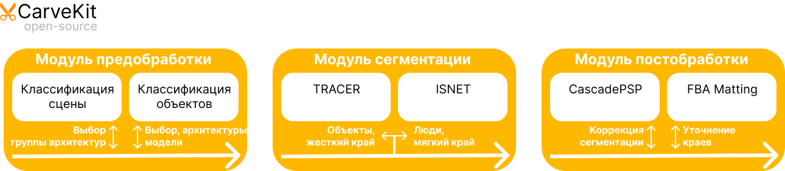

## Project Architecture Description
The software complex is a solution for automatically removing the background from images using neural networks.

### Software Architecture

The software consists of the following components:
* Preprocessing module;
* Segmentation module;
* Post-processing module.

When an image is processed, it is passed sequentially through the specified modules, possibly as part of an image package (depending on the configuration set by the user during use).

## Description of Modules Functionality

### Preprocessing Module
The preprocessing module consists of scene and object classifiers that are applied depending on the complexity of the processed image and determine the segmentation modules to be used later.

### Segmentation Module
The segmentation module is represented by two options: TRACER and ISNet, and the specific module is selected during preprocessing.
The segmentation module creates a mask for the image, which represents the probability for each pixel of the image to be part of the main object in the image.
In addition to the mentioned segmentation modules, the project also includes other segmentation modules that can be used as the main segmentation module:
1. U-2-Net;
2. BASNet;
3. DeepLabV3;

### Post-processing Module
The post-processing module eliminates errors in segmentation by refining the mask to the required quality. Two models are applied sequentially during post-processing: CascadePSP and FBA Matting. They implement fundamentally different approaches and refine only the edges of the mask in those areas where the probability returned by the segmentation module does not allow us to confidently determine the pixel's belonging to the image. After post-processing, the mask is applied to the images, leaving only the pixels of the input image that are included in it.